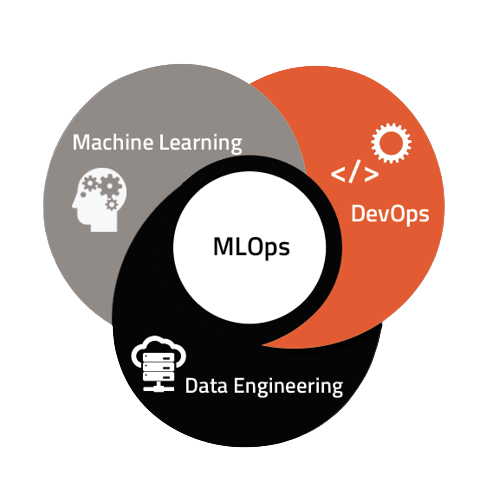

# Henry_PI1-MLOps-
(MVP) MLOps project - Game recommendations from Steam datasets using machine learning

<h1 align=center> <strong>Henry Labs - Data Science</strong> </h1>
<h1 align=center><strong>Machine Learning Operations (MLOps)</strong></h1>

# **Introduction**

Welcome to the first individual project of Henry Labs!

In this project, I developed an API ohat makes Steam gaming datasets available. The API includes 5 endpoints, 3 of which use machine learning to generate recommendations and perform sentiment analysis.

